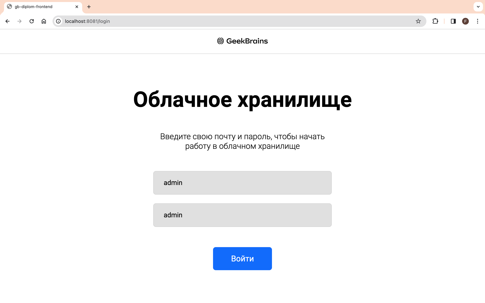
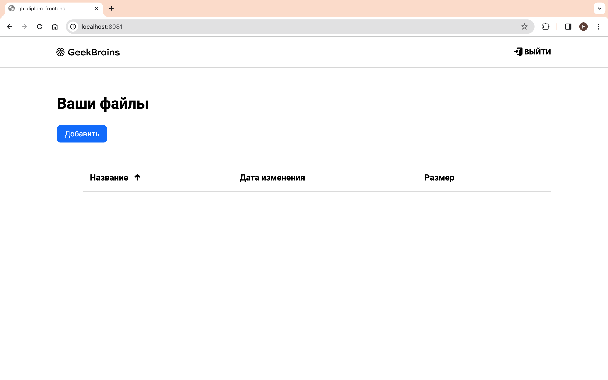
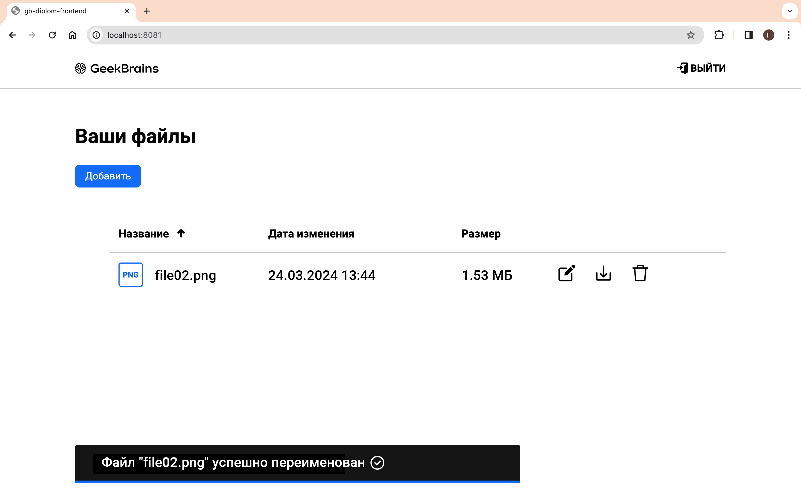
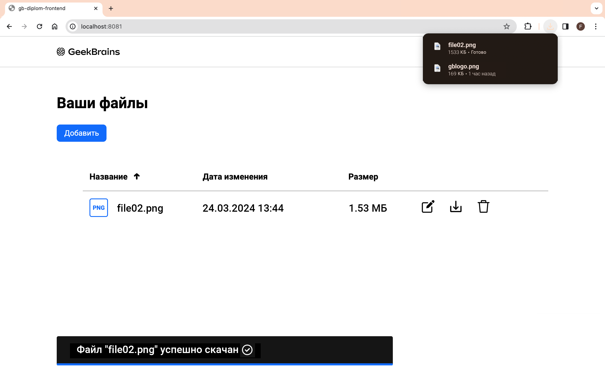
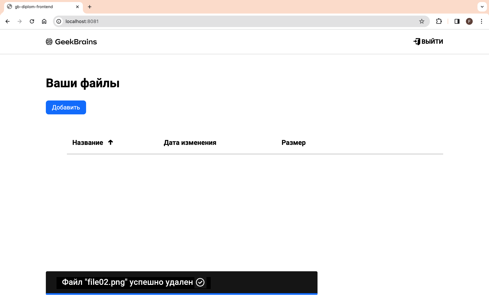
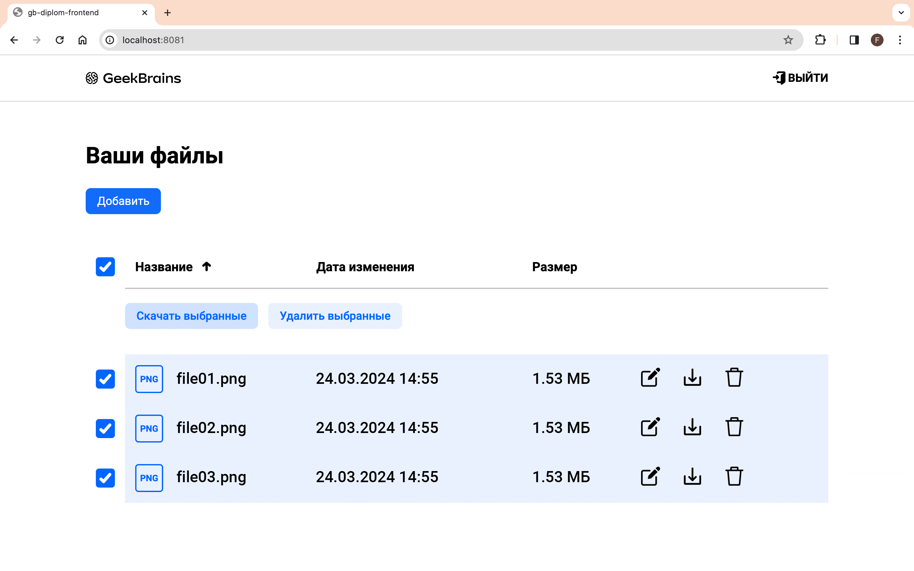

# Итоговая работа «Облачное хранилище»
***
## Описание итогового проекта
Backend сервис для хранения файлов, взаимодействует с frontend по принципам REST.\
Особенностью проекта является применение JWT аутентификации, реализация которой выполнена внутри самого сервиса. Используемые технологии Spring Boot 3.x, Java 17, Docker, Liquebase, PostgreSQL.

## Перед началом работы
1. Определен администратор с глобальными правами: *login = admin*, *password = admin*. Создание новых пользователей не предусмотрено, для демонстрации работы приложения необходимо использовать данные администратора.
2. Каждый запрос клиента серверу должен содержать заголовок *auth-token*, в котором находится токен, получаемый при успешной аутентификации.
3. Разрешенный размер файла для хранения менее 10 Мб.
4. Наименование загружаемого файла должно содержать одну точку-разделитель между именем и расширением (*filename.ext*)
5. **!!!** Запрещено вставлять файлы с одинаковыми именами

## Запуск
Перейти в корень, собрать проект:
> `mvn clean package --Dskiptests`

В корневой папке выполнить команду:
> `docker compose up`

## Примеры запуска
Вход в систему от имени администратора

Интерфейс пользователя

Загрузка файлов в хранилище

Переименование файла в хранилище

Выгрузка файлов

Удаление файла

Работа с несколькими файлами

